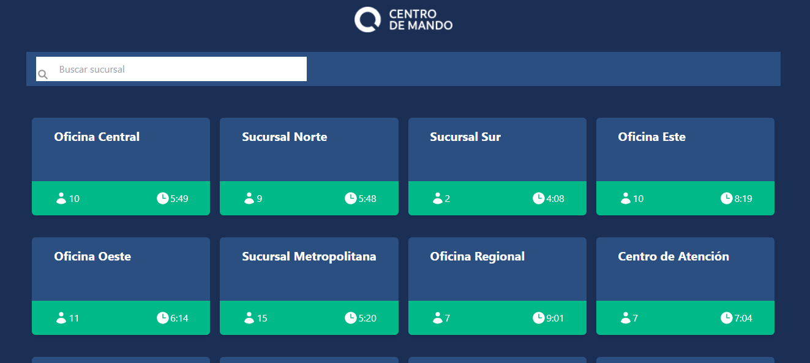
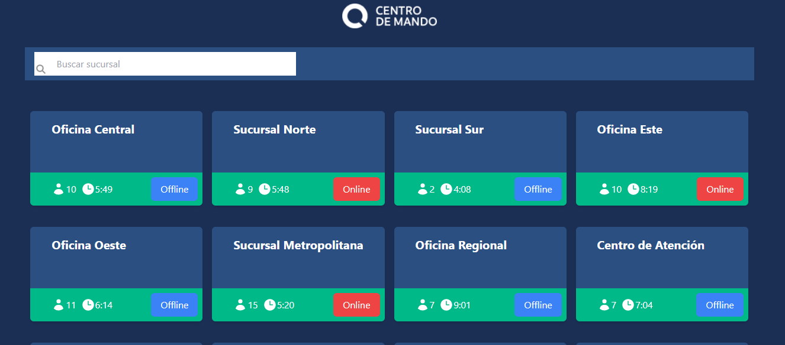

# Prueba frontend

En Zeroq, buscamos un desarrollador frontend con experiencia en Next.js, Tailwind CSS y ReactJS . Este desafío evaluará habilidades clave en el desarrollo frontend moderno, incluyendo el manejo de APIs, el diseño responsive y la implementación de funcionalidades interactivas.

## Restricciones 👀

1. Debido a que todos nuestros proyectos frontend están desarrollados con React.js y Nextjs, es importante que completes este desafío utilizándolos.
2. Se puede usar cualquier librería.

## Lo que necesitaras

**Assets:**

En este documento agregaremos algunos assets para que puedas completar la prueba de forma exitosa, algunas imágenes que puedan servir como mockup y el logo correspondiente.

Tambien dejaremos al final del documento un JSON Para que puedas servir con la API de Next y renderizar las cards.

**Objetivo:** Desarrollar una aplicación en Next.js que consuma una API Restful interna para mostrar información sobre oficinas, utilizando Tailwind CSS para el estilo, y asegurando un diseño responsivo.

### Requisitos Técnicos:

- **Next.js (última versión)**: Crear la aplicación dentro del directorio **`app`**, utilizando las funcionalidades más recientes de Next.js.
- **Tailwind CSS**: Utilizar Tailwind CSS para el diseño y estilización de la aplicación.
- **React Hooks**: Emplear Hooks para manejo de estado y efectos.

### Tarea a Realizar:

1. **API Restful Interna**: Dentro del directorio **`app`**, crear un archivo **`offices.json`** con los datos de las oficinas a mostrar. Desarrollar un endpoint **`api/offices`** que sirva estos datos.
2. **Interfaz de Usuario**:
    - **Custom Hook para Consumir API**: Implementar un custom Hook que consuma el endpoint creado, extrayendo la lista de oficinas y manejando la actualización de datos cada minuto.
    - **Listado de Oficinas**: Usar la respuesta del Hook para listar oficinas, mostrando nombre, estado, total de personas en fila, y tiempo de atención promedio.
    - **Filtrado por Nombre**: Incluir un campo de texto que permita filtrar las oficinas mostradas por nombre.
    - **Cambio de Estado**: Añadir funcionalidad para cambiar el estado de cada oficina entre online y offline al interactuar con su tarjeta.
3. **Diseño y Documentación**:
    - **Maquetación Según Diseño**: Asegurar que el prototipo desarrolle un alto grado de fidelidad respecto al diseño proporcionado, utilizando Tailwind CSS.
    - **README**: Preparar un documento README con instrucciones claras sobre cómo construir, ejecutar y probar la aplicación.

### Evaluación y Bonus:

- **Evaluación**: Se valorará la calidad del código, el cumplimiento de los requisitos funcionales y técnicos, la fidelidad al diseño, y la implementación de prácticas de desarrollo modernas.
- La prueba tiene un plazo máximo de 24 horas para completarla, después de que se te sea entregada.

## **EXITOS 🚀🚀🚀**

## Assets:

## Instalación
1. Clonar el repositorio:
`git clone https://docs.github.com/en/repositories`;

## Instalar las dependencias:
`npm install`;

## Ejecución
2. Iniciar el servidor de desarrollo:
`npm run dev`;

3. Abrir la aplicación en su navegador:
`http://localhost:3000`

## Documentación:
Next.js: https://nextjs.org/docs
CSS de viento de cola: https://tailwindcss.com/docs
Ganchos de reacción: https://reactjs.org/docs/hooks-reference.html

## Licencia: 
Este proyecto está licenciado bajo la licencia MIT: https://choosealicense.com/licenses/mit/.

